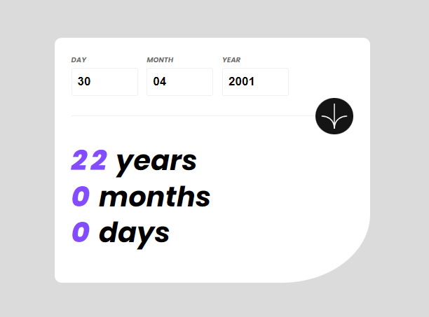
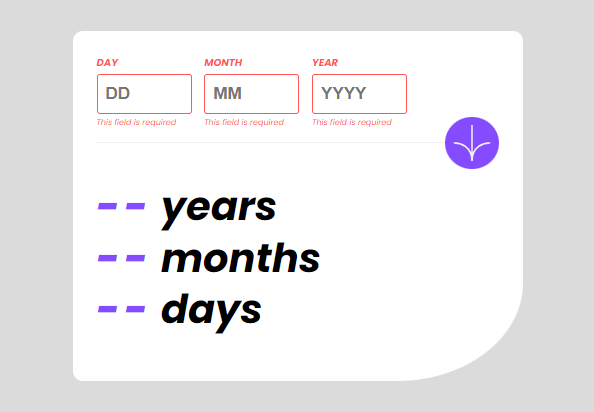

# Frontend Mentor - Age calculator app solution

This is a solution to the [Age calculator app challenge on Frontend Mentor](https://www.frontendmentor.io/challenges/age-calculator-app-dF9DFFpj-Q). Frontend Mentor challenges help you improve your coding skills by building realistic projects. 

## Table of contents

- [Overview](#overview)
  - [The challenge](#the-challenge)
  - [Screenshot](#screenshot)
  - [Links](#links)
- [My process](#my-process)
  - [Built with](#built-with)
  - [What I learned](#what-i-learned)
  - [Continued development](#continued-development)
- [Author](#author)


## Overview

### The challenge

Users should be able to:

- View an age in years, months, and days after submitting a valid date through the form
- Receive validation errors if:
  - Any field is empty when the form is submitted
  - The day number is not between 1-31
  - The month number is not between 1-12
  - The year is in the future
  - The date is invalid e.g. 31/04/1991 (there are 30 days in April)
- View the optimal layout for the interface depending on their device's screen size
- See hover and focus states for all interactive elements on the page
- **Bonus**: See the age numbers animate to their final number when the form is submitted

### Screenshot





### Links

- Solution URL: [Github](https://github.com/Emmanuel-obiora/age-calc-app)
- Live Site URL: [Github Pages](https://emmanuel-obiora.github.io/age-calc-app)

## My process

### Built with

- Semantic HTML5 markup
- CSS custom properties
- Flexbox
- CSS Grid
- [React](https://reactjs.org/) - JS library
- Sass

### What I learned

This project like every other pushed me beyond my comfort zone especially with the fact that no re-usable component has a predefined solution that properly attended to challenges needs. The former pushed me in defining the logic and conditions required to make the application function maximally.

Here are some codes I am pround of:

```js
if(age.month == 2 && age.day > 29){
      const errMessage = document.getElementById('Day').parentNode;
      const sentMsg = document.getElementById('sentMsg1');
  
      sentMsg.innerHTML='Must be a valid day';
      errMessage.classList.add('section-error');
      document.getElementById('dispYear').innerHTML = '--';
      document.getElementById('dispMonth').innerHTML = '--';
      document.getElementById('dispDay').innerHTML = '--';
}
```

### Continued development

I am hopeful that sometime in the future I should be able to develop this logic to become a re-usable component where devs. can utilize maximally.

## Author

- Website - [Obiora Emmanuel](https://emmanuel-obiora.github.io/portfolio-about-me-/web-content)
- Frontend Mentor - [@Emmanuel-obiora](https://www.frontendmentor.io/profile/Emmanuel-obiora)
- Twitter - [@Miroclesdgenius](https://twitter.com/Miroclesdgenius)
